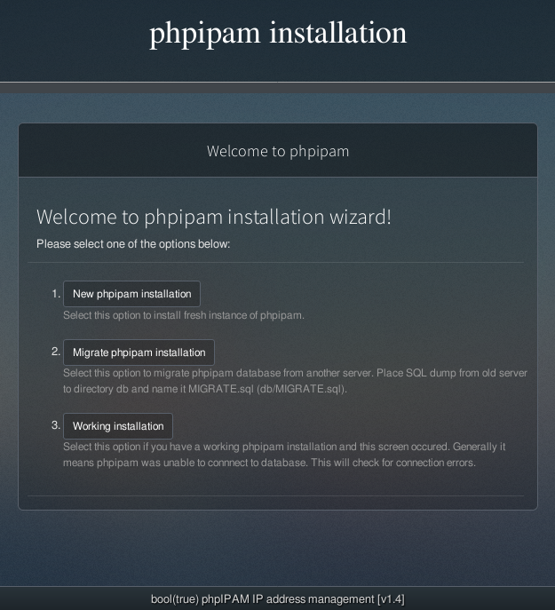
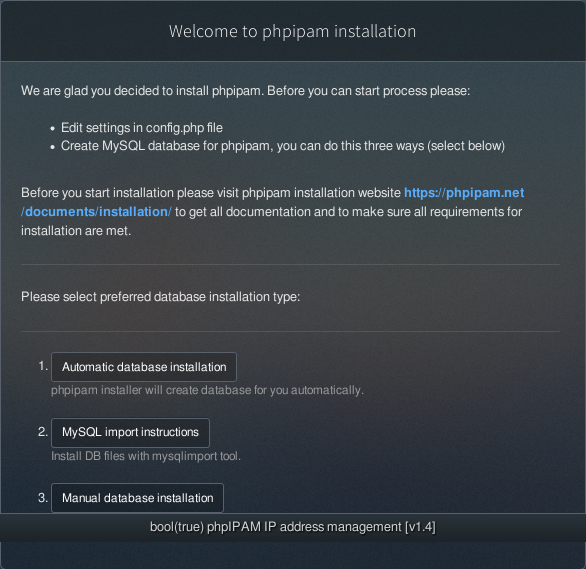
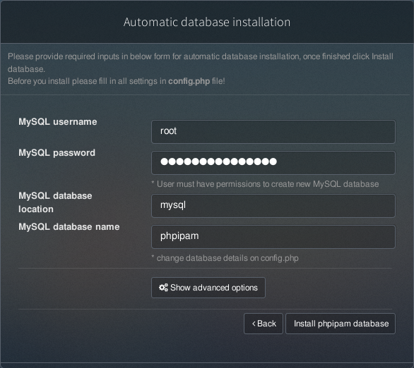
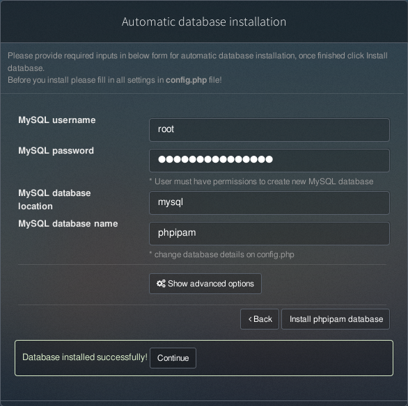

# create a dev environment using vagrant

## Install vagrant and virtualbox

## clone this repo and vagrant up

```bash
# clone this git repo
git clone https://github.com/yoke88/PSPHPIPAM

cd PSPHPIPAM

# suppose you have install virtualbox and vagrant
# change the line 'config.vm.box = "centos7"' in Vagrantfile.host to "config.vm.box ="generic/centos7" or something you can find in https://app.vagrantup.com/boxes/search?provider=virtualbox&q=centos7&sort=downloads&utf8=%E2%9C%93


# if your are on linux,using below command

./buildenv.sh

# if you using windows, using below command
./buildenv.ps1

```
``` text
Bringing machine 'mysql' up with 'docker' provider...
Bringing machine 'phpipam' up with 'docker' provider...
==> mysql: Docker host is required. One will be created if necessary...
==> phpipam: Docker host is required. One will be created if necessary...
    mysql: Docker host VM is already ready.
    phpipam: Docker host VM is already ready.
==> mysql: Provisioners will not be run since container doesn't support SSH.
==> phpipam: Provisioners will not be run since container doesn't support SSH.

==> phpipam: Machine 'phpipam' has a post `vagrant up` message. This is a message
==> phpipam: from the creator of the Vagrantfile, and not from Vagrant itself:
==> phpipam: 
==> phpipam: 
==> phpipam:   ========================================================================
==> phpipam:     config the phpipam env at      : http://127.0.0.1:8080/
==> phpipam:     the default mysql root pass is : my-secret-pw-Oo
==> phpipam:   ========================================================================
==> phpipam:     

```

## configure PHPIPAM 

- access `http://127.0.0.1:8080`
    
- click "new phpipam installation"
    
- click "Automatic database installation" **default mysql password is** `my-secret-pw-Oo`
    

- click "install phpipam database"
    
- click "continue" to set admin 

- change admin password to `password` ,my test script use username=admin and password=`password`

## ok ,we are done
