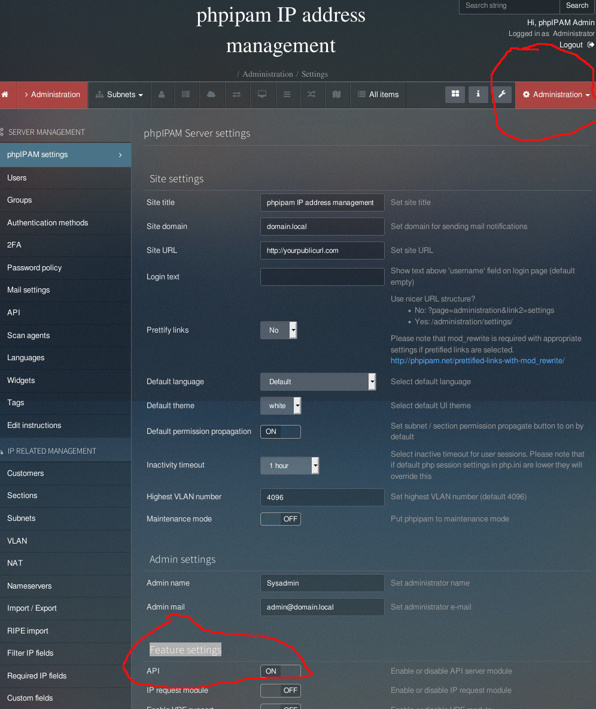
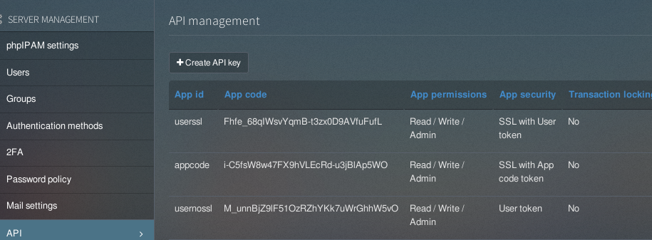

# configure PHPIPAM to using api

## Enable API 

- goto "Administrattion->Feature settings-->API" ,and turn API feature ON, and confirm you save the setting.

    

## Create API token

### create three api types 
- SSL with User token       = useCredAuth + https + AppID + Username + Password
- User token                = useCredAuth + http + AppID  + Username + password
- SSL with App code token   = UseStaticAppKeyAuth + https + AppID + AppCode

> check the Tests/*.ps1 to see examples

> no support and more test with 'encryped' 

